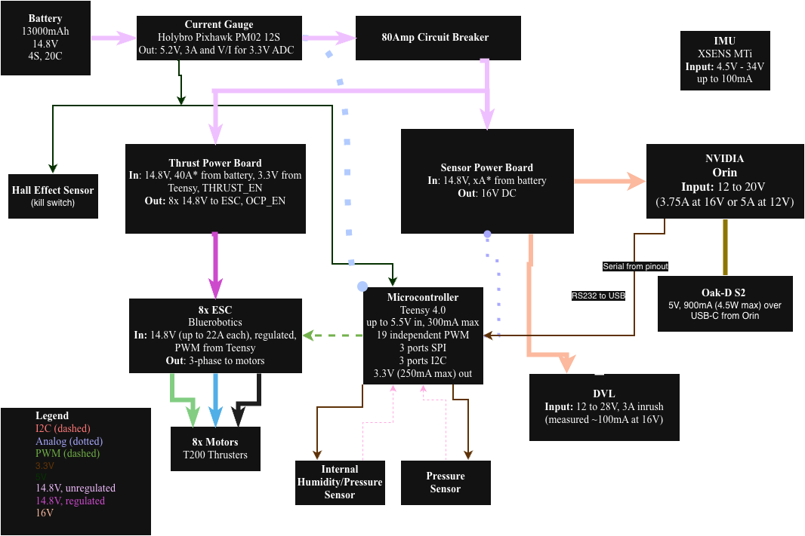

# Gen 1 Submarine (deprecated)

The first hardware generation of the Stanford RoboSub vehicle. This generation
is deprecated — the physical sub no longer exists — and the design files are
kept here for reference only. New work happens in [`gen2/`](../gen2/) (current
platform) and [`gen3/`](../gen3/) (in progress).

## PCBs

The three gen 1 boards live under [`PCBs/`](PCBs/):

- **`Compute_Power_Board/`** — regulated power supply for the compute stack.
- **`Power_Distribution_Board/`** — takes battery input and distributes it to
  the vehicle's power rails.
- **`Teensy_Board/`** — Teensy 4.0 carrier with the audio shield, the main
  microcontroller board for this generation.

_Last updated: 2026-07-20_
