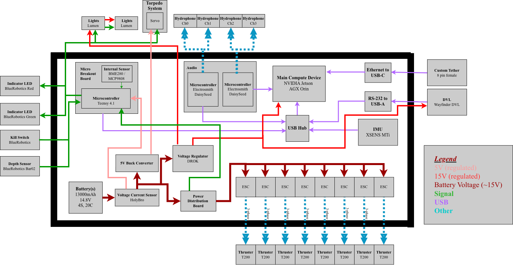

# Gen 2 Submarine (current platform)

The second hardware generation and the current working platform for the
Stanford RoboSub vehicle. This is the generation that actually runs today; new
firmware and most active bring-up happens here while [`gen3/`](../gen3/) is
being designed.

## Contents

- **`PCBs/`** — the gen 2 board designs (KiCad). See [`PCBs/README.md`](PCBs/README.md)
  for which boards are in use and which are experimental.
- **`teensy_firmware/`** — Teensy 4.1 firmware (thrusters, sensors, kill
  switch, telemetry). See [`teensy_firmware/README.md`](teensy_firmware/README.md).
- **`daisyseed_firmware/`** — Electrosmith Daisy Seed audio-board firmware for
  the four hydrophones. See [`daisyseed_firmware/README.md`](daisyseed_firmware/README.md).

## ⚠️ USB hub is finicky

The onboard USB hub has been a persistent source of trouble and took a lot of
trial and error to get working. **Which physical port a device is plugged into
matters** — specific ports work for specific sensors/boards, and swapping them
around breaks enumeration or causes intermittent `-71`/`-110` errors. If a
sensor or board isn't showing up, the port assignment is the first thing to
check before assuming a hardware fault. Treat the known-good port mapping as
load-bearing and avoid re-plugging devices into different ports.

## TODO

- Test the DEV firmware's BME280 internal pressure reading, SD-card logging,
  and the Orin-side telemetry parsing against the current telemetry key names.

_Last updated: 2026-07-20_
