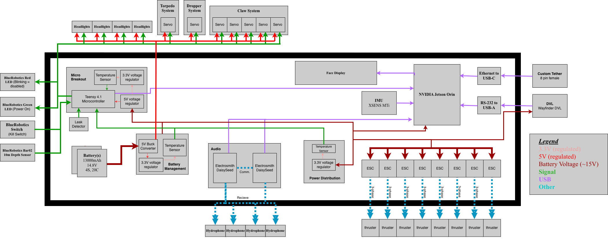

# Gen 3 Submarine (in progress)

The third hardware generation, currently being designed. The proposed system
architecture is shown below; the boards under [`PCBs/`](PCBs/) are the work
toward it. The current working vehicle is still [`gen2/`](../gen2/).

## PCBs

- **`Micro_Breakout/`** — the main breakout board for gen 3, the successor to
  the gen 2 MLU breakout. References the shared parts library in
  [`../../imported_parts`](../../imported_parts).
- **`Battery_Boards/`** — the gen 3 power-management / battery boards, the
  follow-on to the gen 2 `Power_Management` boards (which had heat problems).
  Two design variants:
  - **`Power_ManagementV3_diode/`** — the diode-based design; this is the lead
    design.
  - **`Power_ManagementV3_eli/`** — Eli's alternative design, kept as a backup.
- **`Power_Distribution/`** — the gen 3 power-distribution board (battery →
  rails).
- **`to_order/`** — staging area for boards that are ready to be fabricated
  (currently empty).

## TODO

- Finalize how signals/power route in and out of `Micro_Breakout`, and choose
  the physical dimensions of all the boards.
- Order the PCBs.

_Last updated: 2026-07-20_
